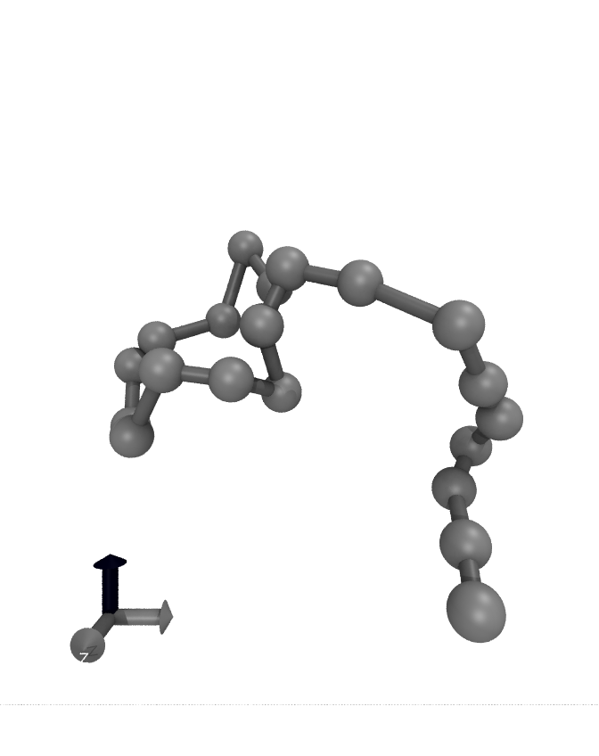

# 🧪 Your First Polymer
Welcome to the polymer modeling guide for PE!

Just as every programmer starts with a simple ```"Hello World!"``` program, we are now going to set up your first polymer simulation using PE software. This tutorial will walk you through the key input files and the steps required to generate your first output data.

---------------------------------
##pe.in
This is a necessary file needed for running any simulation. This file and all it's keywords will be discussed in further sections of this documentation. For the purposes of this demonstration we will create one simple chain in simulation box using keywords ``` chain, chain_length, box``` and ```cycles```.

pe.in has a simple structure of a keyword separated from it's value by a space. Knowing this, we will create this simple input file:

pe.in example
------------------------
```bash
chains 1
chain_length 20
box 40
cycles 100
```
Now that we have created the simple input file we can run our first simulation using:
```bash
./pe pe.in
```
The last three lines of your output should look something like this:

```bash
# n=20, cycles=100(+0), n_beta=1, t_beta=1, beta0=0.01, dt 0.02(*20T); <log(w)>=0 +- 0, SG 1, <Re> 5.56 +- 0.04 (0.39), <Rg> 2.62 +- 0.01 (0.11), <r^2> 1.27, AR 1.000, NE 101, NF 2001
# accepted/rejected 100/0, RX accepted/rejected 0/0, PX accepted/rejected 0/0
# 100 steps done, 0.4s (3.6ms per step)
```
##Typical Outputs
We will now discuss typical outputs of pe.

pe.xyz
------------------
This is an integral part of pe simulation output. This file contains coordinates of the simulation in .xyz format. As an example of the xyz format we present an example of two potential frames.
```bash
Number of Atoms
Comment line of first screenshot
ATOM1
ATOM2
.
.
.
.
ATOMN
Number of Atoms
Comment line of second screenshot
ATOM1
.
.
.
.
ATOMN
```
pe.chk
------------------
This is automatically generated checkpoint for the simulation. This feature must be turned on in the pe.in with it's keyword and value.
```bash
check -1
```
Value of check lets you choose which types should be loaded from checkpoint. All types with index < check value will be loaded. To load everything check value must be lower than 0 as is in the example above. More on this is explained in section about input keywords.
Checkpoint stores data about the simulation for smooth restart. Following will be kept from the last run:
!!! note "Look for what is kept."

pe.tcl
------------------
This tcl script is automatically generated for VMD for given structure of chains. Here lies all the info about chemical bonds, used by visualization software VMD, which we recommend using.
Using ```vmd -f pe.xyz -e pe.tcl``` we then get the following image:


pe6.data
------------------
Here we have data stored in binaries, which are compatible with ad software.
!!! note "Is this correct ? Anything interesting here ?"