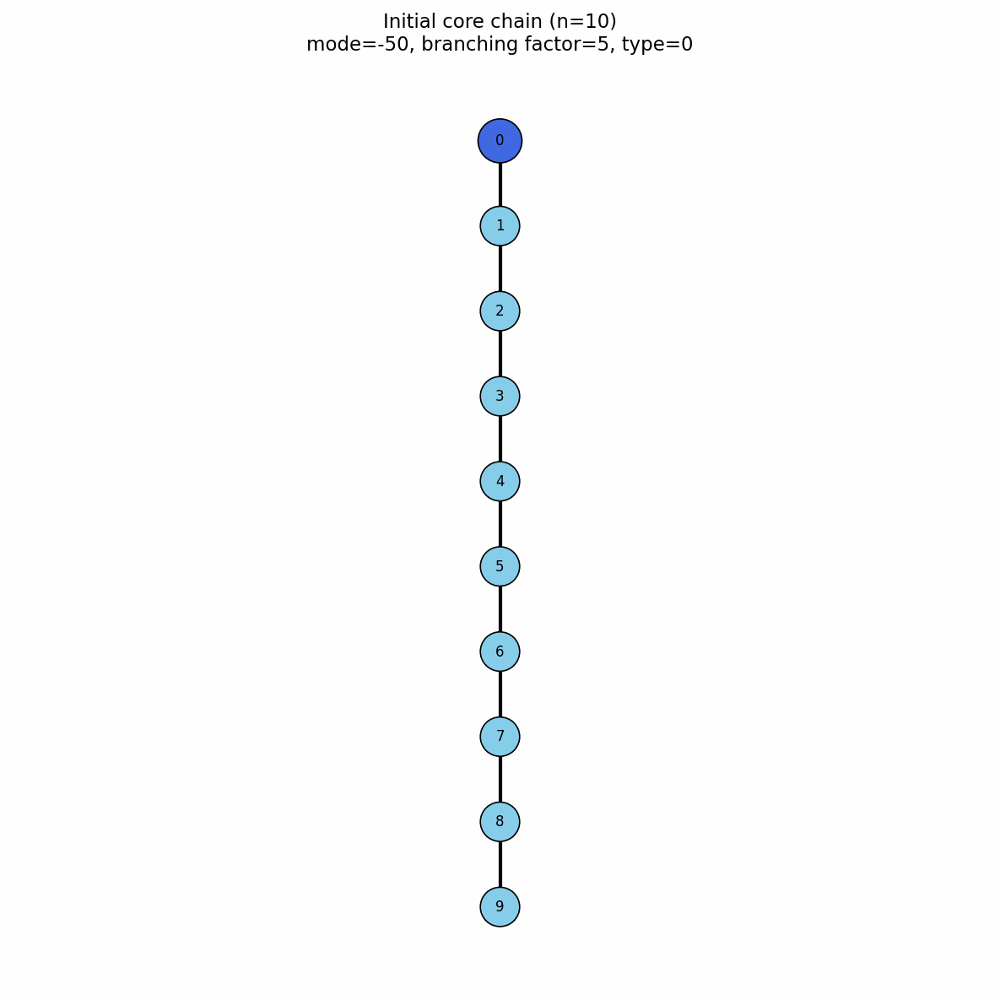
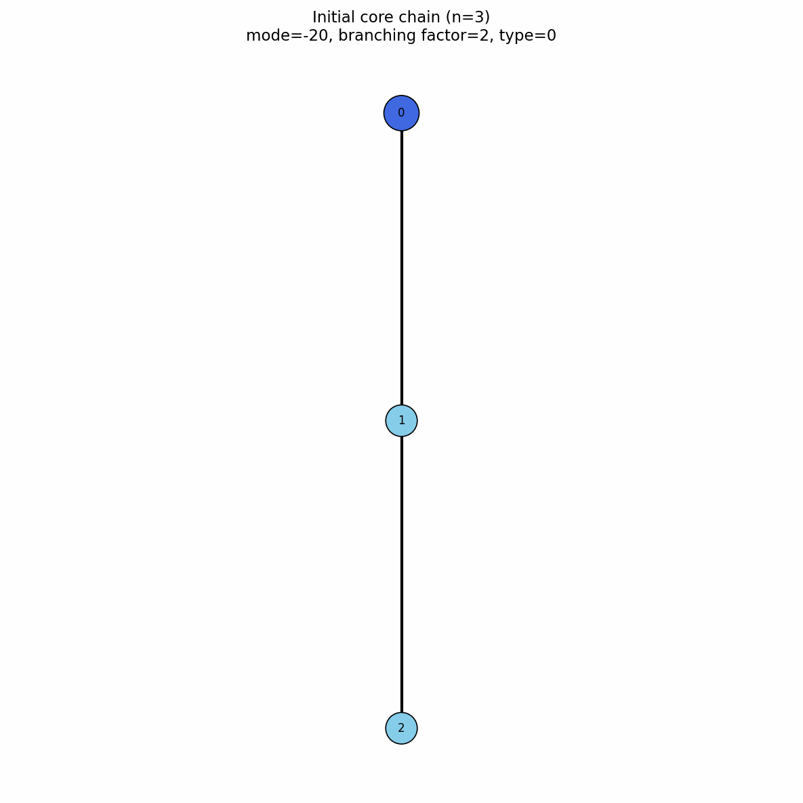

# Model_type 0 - init_sc

This initialization is used for creating everything from simple homopolymer to stars, combs, gels and much more.

## Chain defining parameters


```chains int``` - number of chains in the system

```chain_length int``` - length of a single polymer chain

```n_branches int``` - number of branches on a single polymer chain (if branching is present)

```branch_length int``` - length of a single branch (if branching is present)

## Mode
```mode int``` - mode of branching, this parameter directly influences grafting of branches onto the main polymer chain. 

Example values for mode :

### Random grafting
```mode -1``` 

grafts branches at random positions of the main chains

### Dendrimer grafting
```mode -2``` 

grafts branches to create a dendrimer, this setting changes multiple parameters

```chain_length int``` - length of the base chain. All additional branches originate from bead 0 of this chain.
```branch_length``` - length of branches

!!! danger "Requirement"
    ```chain_length``` = ```branch_length``` + 1, note that first set of branches always contains one more branch than the branches originating from the remaining knots.

```mode -int / 10 ``` - the number of branches originating from a single knot, for simplicity we will call this ```bf``` as a short for branching factor


| Parameter | Example 1 | Example 2 |
|---|---|---|
| Representation | { width="600" } | { width="600" } |
| Description | Incomplete dendrimer branching | Complete dendrimer branching |
| `chain_length` | `10` | `3` |
| `branch_length` | `9` | `2` |
| `b_f (mode / 10)` | `5` | `2` |
| `mode` | `-50` | `-20` |

Number of branches in a complete dendrimer

For a complete dendrimer, the total number of branches is

\[
n_{\mathrm{branches}}
=
b_f
+
(b_f+1)\sum_{i=1}^{g} b_f^i
\]

where:

- \(b_f\) is the branching factor,
- \(g\) is the number of complete generations,
- \(n_{\mathrm{branches}}\) is the total number of branches.

For example, when \(b_f=2\) and \(g=2\),

\[
n_{\mathrm{branches}}
=
2
+
3\left(2+2^2\right)
=
20
\]

Parameters and preview for dendrimers can be calculated in our calculator below.


<div id="dendrimer-tool" class="dendrimer-tool">

  <div class="dendrimer-calculator">
    <h3>Dendrimer parameter calculator</h3>

    <label for="chain-length">
      <code>chain_length</code>
    </label>
    <input
      id="chain-length"
      type="number"
      min="2"
      step="1"
      value="3"
    >

    <label for="branching-factor">
      Branching factor
    </label>
    <input
      id="branching-factor"
      type="number"
      min="1"
      step="1"
      value="2"
    >

    <label for="generations">
      Number of generations
    </label>
    <input
      id="generations"
      type="number"
      min="1"
      step="1"
      value="2"
    >

    <div class="dendrimer-buttons">
      <button
        id="generate-dendrimer"
        class="dendrimer-button"
        type="button"
      >
        Generate
      </button>

      <button
        id="copy-dendrimer"
        class="dendrimer-button"
        type="button"
      >
        Copy parameters
      </button>
    </div>

    <pre id="dendrimer-parameters">—</pre>

    <p id="dendrimer-error"></p>
  </div>

  <div class="dendrimer-preview">
    <h3>Dendrimer structure preview</h3>

    <div class="dendrimer-svg-wrapper">
      <svg
        id="dendrimer-svg"
        viewBox="0 0 900 650"
        preserveAspectRatio="xMidYMid meet"
        role="img"
        aria-label="Static dendrimer structure"
      ></svg>
    </div>

    <p id="dendrimer-status">
      Change the parameters or press Generate.
    </p>
  </div>

</div>


### Comb grafting


For branch \(i\), the grafting site on the backbone is

\[
k_i = (k_0 + i s)\bmod n
\]

where \(k_0\) is the first grafting index, \(s\) is the spacing between grafting sites, and \(n\) is `chain_length`.

The `mode` parameter encodes both \(k_0\) and \(s\):

\[
\texttt{mode}=sn+k_0
\]

The values can be recovered as

\[
k_0=\texttt{mode}\bmod n
\]

and

\[
s=\left\lfloor\frac{\texttt{mode}}{n}\right\rfloor
\]

For example, with \(n=20\), \(k_0=1\), and \(s=2\),

\[
k_i=(1+2i)\bmod20
\]

which gives the grafting indices

\[
1,3,5,7,9,\ldots
\]

and

\[
\texttt{mode}=2\cdot20+1=41.
\]


<div id="comb-tool" class="comb-tool">

  <div class="comb-calculator">
    <h3>Comb polymer calculator</h3>

    <label for="comb-chain-length">
      <code>chain_length</code>
    </label>
    <input
      id="comb-chain-length"
      type="number"
      min="2"
      step="1"
      value="20"
    >

    <label for="comb-branch-length">
      <code>branch_length</code>
    </label>
    <input
      id="comb-branch-length"
      type="number"
      min="1"
      step="1"
      value="5"
    >

    <label for="comb-number-branches">
      <code>n_branches</code>
    </label>
    <input
      id="comb-number-branches"
      type="number"
      min="1"
      step="1"
      value="8"
    >

    <label for="comb-first-attachment">
    First attachment index
    </label>
    <input
    id="comb-first-attachment"
    type="number"
    min="0"
    step="1"
    value="1"
    >

    <label for="comb-spacing">
      Attachment spacing
    </label>
    <input
      id="comb-spacing"
      type="number"
      min="1"
      step="1"
      value="2"
    >

    <div class="comb-buttons">
      <button id="generate-comb" type="button">
        Generate
      </button>

      <button id="copy-comb" type="button">
        Copy parameters
      </button>
    </div>

    <pre id="comb-parameters">—</pre>

    <p id="comb-error"></p>
  </div>

  <div class="comb-preview">
    <h3>Comb structure preview</h3>

    <div class="comb-svg-wrapper">
      <svg
        id="comb-svg"
        viewBox="0 0 1000 620"
        preserveAspectRatio="xMidYMid meet"
        role="img"
        aria-label="Static comb polymer structure"
      ></svg>
    </div>

    <p id="comb-status">
      Change the parameters or press Generate.
    </p>
  </div>

</div>

### Diamond gel grafting

Special case for ```mode > 0``` is gel formation made by setting ```chains -1```. The diamond gel consists of eight permanent branching nodes connected by 16 polymer arms. Four nodes form the inner set and four form the outer set, with every inner node connected to every outer node.

If each arm contains \(n_{\mathrm{arm}}\) internal beads, the total gel size is

\[
n = 8 + 16n_{\mathrm{arm}}
\]

where the first eight bead indices, \(0\) to \(7\), are the branching nodes.

The remaining beads,

\[
8,9,\ldots,n-1,
\]

form the internal parts of the 16 gel arms and can be used as grafting sites.

For grafting in comb mode, the attachment index is updated as

\[
k_{i+1}
=
8+
\left[
(k_i-8)+s
\right]
\bmod(n-8)
\]

where

\[
s=
\left\lfloor
\frac{\texttt{mode}}{n-8}
\right\rfloor
\]

is the step between grafting sites.

The subtraction and addition of \(8\) ensure that grafts are attached only to arm beads and never to the eight gel junctions.


<div id="gel-comb-tool" class="gel-comb-tool">
  <div class="gel-comb-calculator">
    <h3>Diamond-gel grafting calculator</h3>

    <label for="gel-arm-length">
      Internal beads per gel arm
    </label>
    <input
      id="gel-arm-length"
      type="number"
      min="1"
      step="1"
      value="5"
    >

    <label for="gel-branch-length">
      <code>branch_length</code>
    </label>
    <input
      id="gel-branch-length"
      type="number"
      min="1"
      step="1"
      value="4"
    >

    <label for="gel-number-branches">
      <code>n_branches</code>
    </label>
    <input
      id="gel-number-branches"
      type="number"
      min="1"
      step="1"
      value="12"
    >

    <label for="gel-graft-spacing">
      Grafting step
    </label>
    <input
      id="gel-graft-spacing"
      type="number"
      min="1"
      step="1"
      value="3"
    >

    <div class="gel-comb-buttons">
      <button id="generate-gel-comb" type="button">
        Generate
      </button>

      <button id="copy-gel-comb" type="button">
        Copy parameters
      </button>
    </div>

    <pre id="gel-comb-parameters">—</pre>

    <p id="gel-comb-error"></p>
  </div>

  <div class="gel-comb-preview">
    <h3>Gel-arm grafting preview</h3>

    <div class="gel-comb-svg-wrapper">
      <svg
        id="gel-comb-svg"
        viewBox="0 0 1000 760"
        width="1000"
        height="760"
        preserveAspectRatio="xMidYMid meet"
        role="img"
        aria-label="Diamond gel grafting scheme"
      >
        <rect
          x="0"
          y="0"
          width="1000"
          height="760"
          fill="white"
        ></rect>

        <text
          x="500"
          y="380"
          text-anchor="middle"
          fill="#666"
          font-size="20"
        >
          Loading gel preview…
        </text>
      </svg>
    </div>

    <p id="gel-comb-status">
      Loading calculator…
    </p>
  </div>
</div>